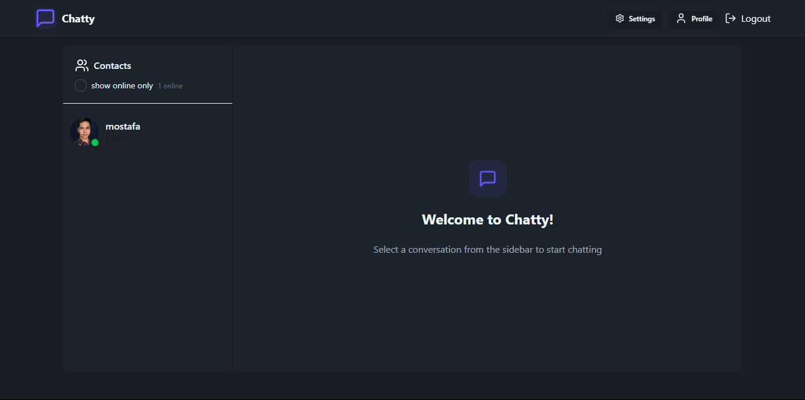

# 💬 Chatty — Real-Time Chat App

**Chatty** is a fully functional **real-time chat application** built with the MERN stack (MongoDB, Express.js, React, Node.js), combined with **Socket.io** for real-time communication. This project was developed during my internship at **Coding Samurai**, focused on delivering a responsive, scalable, and secure messaging platform.

---

## 🚀 Live Demo

[🔗 View Live App](https://realtime-chat-app-r0wc.onrender.com/)

---

## 📸 Screenshots



---

## 🛠️ Tech Stack

### 🧩 Frontend

- ⚛️ **React.js**
- 🎨 **Tailwind CSS**
- 🔐 **JWT Authentication**
- 🌥 **Cloudinary** (for user avatars)
- ⚡ **Socket.io Client**

### 🖥 Backend

- 🟩 **Node.js** + **Express.js**
- 🗂 **MongoDB** (Mongoose ODM)
- 🔐 **JWT** for secure session management
- ⚡ **Socket.io Server** (WebSockets)
- ☁️ **Cloudinary** (media upload support)

---

## ✨ Features

- 🔒 User authentication (JWT)
- 💬 Real-time messaging with **Socket.io**
- 🟢 Online user presence tracking
- 🧑‍🤝‍🧑 1-on-1 conversations
- 🖼️ Profile picture upload via Cloudinary
- 🧭 Clean, responsive UI built with Tailwind CSS
- 🌐 Persistent message storage with MongoDB
- 🚀 Optimized REST APIs with Express.js

---

## 📦 Getting Started

### 1. Clone the Repository

```bash
git clone https://github.com/mostafa-meerzad/realtime-chat-app.git
cd realtime-chat-app
```

### 2. Setup Environment Variables

Create .env files in both client/ and server/ directories using .env.example as reference.

Backend .env

```txt
PORT=5000
MONGODB_URI=your_mongodb_connection_string
JWT_SECRET=your_jwt_secret
CLOUDINARY_CLOUD_NAME=your_cloud_name
CLOUDINARY_API_KEY=your_api_key
CLOUDINARY_API_SECRET=your_api_secret
```

Frontend .env

```txt
VITE_API_BASE_URL=http://localhost:5000
```

### 3. Install Dependencies

```bash
# Backend
cd server
npm install

# Frontend
cd ../client
npm install

```

### 4. Start the App

```bash
# Start backend
cd server
npm run dev

# Start frontend (in a new terminal)
cd ../client
npm run dev

```

Open <http://localhost:5173> in your browser.

## 📚 Learning Highlights

- Integrated Socket.io for two-way real-time communication

- Managed authentication flow using JWT

- Created REST APIs with Express and tested them

- Handled file uploads with Cloudinary and stored URLs in MongoDB

- Improved frontend UI/UX with Tailwind CSS

## 🙌 Acknowledgments

- Coding Samurai – Internship host and mentorship

- Socket.io Docs

- Cloudinary Docs

- MongoDB

- Tailwind CSS
